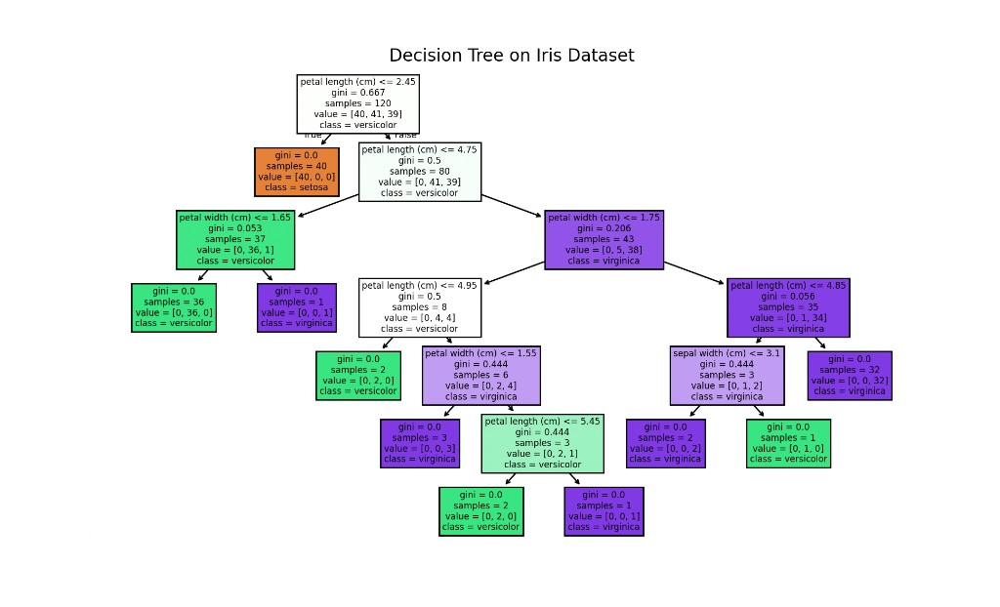

# Decision Tree Classification

A small Python project that trains a **decision tree classifier** on the classic **Iris dataset** and visualizes the learned tree structure. Each node shows the split rule, Gini impurity, sample count, and predicted class.

## Output

Running the script prints test-set accuracy and opens a Matplotlib window with the full decision tree. The tree shows how the model splits on petal and sepal measurements to classify iris flowers into **setosa**, **versicolor**, and **virginica**.



| Metric | Value |
|--------|-------|
| **Test accuracy** | 100% (30/30 correct with default settings) |
| **Training samples** | 120 (80% split) |
| **Test samples** | 30 (20% split) |

## What is a decision tree?

A decision tree is a supervised learning algorithm that makes predictions by asking a series of **yes/no questions** about the input features. Starting at the root, each internal node tests a feature against a threshold (e.g. `petal length (cm) <= 2.45`); samples flow left if the condition is true, right otherwise. Leaf nodes assign a final class label.

The tree is built by choosing splits that **reduce impurity** in the child nodes. This project uses **Gini impurity**, which measures how often a randomly chosen sample would be misclassified if labeled according to the class distribution at that node:

\[
G = 1 - \sum_{k=1}^{K} p_k^2
\]

where \(p_k\) is the proportion of class \(k\) at the node. A Gini of **0.0** means the node is pure (all samples belong to one class).

Unlike logistic regression, decision trees can capture **non-linear** boundaries through a sequence of axis-aligned splits, and they are easy to interpret by reading the tree from root to leaf.

## Project structure

```
decision_trees/
├── decision_tree.py          # Train model, evaluate, and plot the tree
├── requirements.txt          # Python dependencies
├── assets/
│   └── decision_tree_output.png
└── README.md
```

## Requirements

- Python 3.10+
- [scikit-learn](https://scikit-learn.org/) (imported as `sklearn`)
- Matplotlib

Install dependencies:

```bash
pip install -r requirements.txt
```

> **Note:** Install `scikit-learn`, not the deprecated PyPI package `sklearn`.

## How to run

From the project root:

```bash
python3 decision_tree.py
```

This will:

1. Load the Iris dataset (150 samples, 4 features, 3 classes).
2. Split into 80% train / 20% test with `random_state=42`.
3. Fit a `DecisionTreeClassifier` and print test accuracy.
4. Plot the tree with `sklearn.tree.plot_tree` and open a Matplotlib window.
5. Save the figure to `assets/decision_tree_output.png`.

## How it works

### 1. Iris dataset

The Iris dataset contains measurements for three species of iris flowers:

| Feature | Description |
|---------|-------------|
| Sepal length | Length of the sepal (cm) |
| Sepal width | Width of the sepal (cm) |
| Petal length | Length of the petal (cm) |
| Petal width | Width of the petal (cm) |

Classes: **setosa**, **versicolor**, **virginica**.

### 2. Train/test split

```python
X_train, X_test, y_train, y_test = train_test_split(
    X, y, test_size=0.2, random_state=42
)
```

A fixed `random_state` keeps the split reproducible across runs.

### 3. Training

```python
clf = DecisionTreeClassifier(random_state=42)
clf.fit(X_train, y_train)
```

The classifier grows the tree by recursively picking the feature and threshold that yield the largest Gini reduction at each step.

### 4. Tree visualization

```python
tree.plot_tree(
    clf,
    filled=True,
    feature_names=load_iris().feature_names,
    class_names=load_iris().target_names,
)
```

- **Filled nodes** are colored by the majority class at that node.
- **Internal nodes** show the split condition, Gini, sample count, class distribution, and predicted class.
- **Leaf nodes** (Gini = 0.0) are pure — all samples at that node share one class.

In the plotted tree, the first split on **petal length <= 2.45** cleanly separates all **setosa** samples (40) from the other two species, which matches the well-known separability of setosa in this dataset.

## Key concepts

| Term | Meaning |
|------|---------|
| **Root node** | Top of the tree; first split applied to all data |
| **Internal node** | A decision point with a feature threshold |
| **Leaf node** | Terminal node that assigns a class label |
| **Gini impurity** | Measure of node purity (0 = perfectly pure) |
| **Samples** | Number of training points that reach that node |
| **Value** | Class counts at the node, e.g. `[setosa, versicolor, virginica]` |

## Possible extensions

- Limit tree depth with `max_depth` to reduce overfitting and simplify the tree.
- Compare accuracy with `RandomForestClassifier` or `GradientBoostingClassifier`.
- Report a confusion matrix and classification report on the test set.
- Prune the tree using `cost_complexity_pruning_path` and cross-validation.
- Try other datasets (Wine, Breast Cancer) with different feature counts.

## Author

**Duncan Mwirigi**  
GitHub: [github.com/duncanmwirigi](https://github.com/duncanmwirigi)  
X: https://x.com/AIStiqDan  
Website: https://bytecityinc.com

## License

MIT — use and modify freely for learning and projects.
